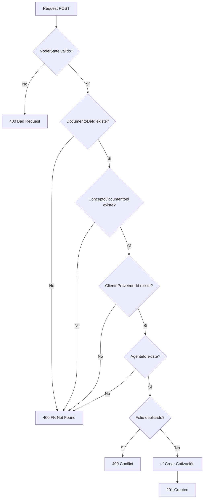

# 📊 RESUMEN VISUAL - CORRECCIONES COTIZACIONES

## 🔄 FLUJO COMPLETO ACTUALIZADO

```
┌─────────────────────────────────────────────────────────────────┐
│                    CLIENTE (Frontend/Postman)                    │
└────────────────────────────┬────────────────────────────────────┘
                             │
                             ▼
┌─────────────────────────────────────────────────────────────────┐
│                   CotizacionesController.cs                      │
│  ┌────────────────────────────────────────────────────────────┐ │
│  │ ✅ Validación de ModelState                                │ │
│  │ ✅ Manejo de excepciones específicas:                      │ │
│  │    • ForeignKeyNotFoundException → 400 Bad Request         │ │
│  │    • DuplicateRecordException → 409 Conflict               │ │
│  │    • ResourceAccessDeniedException → 403 Forbidden         │ │
│  │    • Exception → 500 Internal Server Error                 │ │
│  └────────────────────────────────────────────────────────────┘ │
└────────────────────────────┬────────────────────────────────────┘
                             │
                             ▼
┌─────────────────────────────────────────────────────────────────┐
│                      CotizacionService.cs                        │
│  ┌────────────────────────────────────────────────────────────┐ │
│  │ ✅ Validación de llaves foráneas (ValidarLlavesForaneas)  │ │
│  │ ✅ Lanzamiento de excepciones personalizadas              │ │
│  │ ✅ Mapeo entre DTOs y Entidades                           │ │
│  │ ✅ Lógica de negocio separada                             │ │
│  └────────────────────────────────────────────────────────────┘ │
└────────────────────────────┬────────────────────────────────────┘
                             │
                             ▼
┌─────────────────────────────────────────────────────────────────┐
│                    CotizacionRepository.cs                       │
│  ┌────────────────────────────────────────────────────────────┐ │
│  │ ✅ GetByEstadoAsync(campo, valor) - Filtrado corregido    │ │
│  │ ✅ GetByClienteIdAsync(clienteId) - Búsqueda por ID       │ │
│  │ ✅ ValidarLlavesForaneasAsync() - Validación de FKs       │ │
│  │ ✅ Consultas optimizadas con AsNoTracking()               │ │
│  └────────────────────────────────────────────────────────────┘ │
└────────────────────────────┬────────────────────────────────────┘
                             │
                             ▼
┌─────────────────────────────────────────────────────────────────┐
│                     Base de Datos (SQL Server)                   │
│  ┌────────────────────────────────────────────────────────────┐ │
│  │ • sales_cotizaciones (tabla principal)                     │ │
│  │ • catalog_clientes (validación ClienteProveedorId)        │ │
│  │ • usuarios_auth (validación AgenteId)                     │ │
│  └────────────────────────────────────────────────────────────┘ │
└─────────────────────────────────────────────────────────────────┘
```

---

## 📍 ENDPOINTS - ANTES vs AHORA

### **GET - Buscar por Estado**

#### ❌ ANTES (No funcionaba correctamente):
```
GET /api/Cotizaciones/estado/CANCELADO
GET /api/Cotizaciones/estado/AFECTADO
GET /api/Cotizaciones/estado/NUEVA
```
**Problema:** String ambiguo, retornaba arreglo vacío

#### ✅ AHORA (Funcionamiento correcto):
```
GET /api/Cotizaciones/estado/cancelado/1   → Canceladas
GET /api/Cotizaciones/estado/cancelado/0   → No canceladas
GET /api/Cotizaciones/estado/afectado/1    → Afectadas
GET /api/Cotizaciones/estado/afectado/0    → No afectadas
GET /api/Cotizaciones/estado/impreso/1     → Impresas
GET /api/Cotizaciones/estado/impreso/0     → No impresas
GET /api/Cotizaciones/estado/usacliente/1  → Usa cliente
GET /api/Cotizaciones/estado/usacliente/0  → No usa cliente
```

### **GET - Buscar por Cliente**

#### ❌ ANTES (No funcionaba):
```
GET /api/Cotizaciones/cliente/Empresa%20ABC
```
**Problema:** Buscaba string en RazonSocial (nulo), retornaba vacío

#### ✅ AHORA (Funcionamiento correcto):
```
GET /api/Cotizaciones/cliente/123
```
**Mejora:** Busca directamente por ClienteProveedorId

---

## 🎯 EXCEPCIONES - MAPEO DE RESPUESTAS

### **Excepción 1: Foreign Key Not Found**
```
POST /api/Cotizaciones
{
  "documentoDeId": 0,        ← ❌ No existe
  "clienteProveedorId": 999  ← ❌ No existe
  ...
}

⬇️ RESPUESTA ⬇️

400 Bad Request
{
  "error": "FOREIGN_KEY_NOT_FOUND",
  "message": "El DocumentoDeId con ID 0 no existe en la base de datos.",
  "campo": "DocumentoDeId",
  "valorId": 0
}
```

### **Excepción 2: Duplicate Record**
```
POST /api/Cotizaciones
{
  "folio": 12345  ← ❌ Ya existe
  ...
}

⬇️ RESPUESTA ⬇️

409 Conflict
{
  "error": "DUPLICATE_RECORD",
  "message": "Ya existe un registro con Folio = '12345'.",
  "campo": "Folio",
  "valor": "12345"
}
```

### **Excepción 3: Access Denied**
```
POST /api/Cotizaciones
{
  "agenteId": 10  ← ❌ Usuario sin permisos
  ...
}

⬇️ RESPUESTA ⬇️

403 Forbidden
{
  "error": "ACCESS_DENIED",
  "message": "No se puede acceder al recurso solicitado."
}
```

---

## 🗂️ ESTRUCTURA DE ARCHIVOS

```
back_cabs/
├── crm/
│   ├── Core/
│   │   └── Exceptions/
│   │       └── CotizacionExceptions.cs          ← ✨ NUEVO
│   │
│   ├── controllers/
│   │   └── Recepcion/
│   │       └── CotizacionesController.cs        ← ✏️ MODIFICADO
│   │
│   ├── services/
│   │   └── Recepcion/
│   │       └── CotizacionService.cs             ← ✏️ MODIFICADO
│   │
│   ├── repositories/
│   │   └── recepcion/
│   │       └── CotizacionRepository.cs          ← ✏️ MODIFICADO
│   │
│   └── Interfaces/
│       └── Recepcion/
│           └── ICotizacionRepository.cs         ← ✏️ MODIFICADO
│
├── documentacion/
│   └── CORRECCIONES_COTIZACIONES.md             ← ✨ NUEVO
│
└── Pruebas_Gnrales/
    └── cotizaciones_corregidas_pruebas.http     ← ✨ NUEVO
```

---

## 🔍 VALIDACIONES IMPLEMENTADAS

### **Al Crear (POST)**



### **Campos Validados**

| Campo | Validación | Tabla de Referencia |
|-------|-----------|---------------------|
| DocumentoDeId | Debe existir | ⚠️ Contpaqi (no disponible aún) |
| ConceptoDocumentoId | Debe existir | ⚠️ Contpaqi (no disponible aún) |
| ClienteProveedorId | Debe existir | ✅ catalog_clientes |
| AgenteId | Debe existir | ✅ usuarios_auth |
| Folio | Único (opcional) | sales_cotizaciones |

⚠️ **NOTA:** DocumentoDeId y ConceptoDocumentoId actualmente solo validan que sean > 0.
Para validación completa, se requiere integración con API de Contpaqi.

---

## 📊 COMPARACIÓN DE DATOS

### **Campos de Estado (Banderas)**

| Campo | Tipo | Valores | Descripción |
|-------|------|---------|-------------|
| Cancelado | int | 0 o 1 | 0 = Activa, 1 = Cancelada |
| Afectado | int | 0 o 1 | 0 = Sin afectar, 1 = Afectada |
| Impreso | int | 0 o 1 | 0 = No impreso, 1 = Impreso |
| UsaCliente | int | 0 o 1 | 0 = No usa cliente, 1 = Usa cliente |

### **Ejemplo de Cotización en BD**

```sql
SELECT 
    CIDDOCUMENTO as Id,
    CFOLIO as Folio,
    CFECHA as Fecha,
    CCANCELADO as Cancelado,
    CAFECTADO as Afectado,
    CIMPRESO as Impreso,
    CUSACLIENTE as UsaCliente,
    CIDCLIENTEPROVEEDOR as ClienteProveedorId,
    CRAZONSOCIAL as RazonSocial,
    CTOTAL as Total
FROM sales_cotizaciones
WHERE CCANCELADO = 0 AND CAFECTADO = 0
ORDER BY CFECHA DESC
```

---

## ✅ CHECKLIST DE PRUEBAS

- [ ] **GET /api/Cotizaciones** - Obtener todas
- [ ] **GET /api/Cotizaciones/{id}** - Obtener por ID
- [ ] **GET /api/Cotizaciones/estado/cancelado/1** - Canceladas
- [ ] **GET /api/Cotizaciones/estado/cancelado/0** - No canceladas
- [ ] **GET /api/Cotizaciones/estado/afectado/1** - Afectadas
- [ ] **GET /api/Cotizaciones/estado/afectado/0** - No afectadas
- [ ] **GET /api/Cotizaciones/cliente/123** - Por cliente ID
- [ ] **POST /api/Cotizaciones** - Crear válida
- [ ] **POST con DocumentoDeId=0** - Error FK
- [ ] **POST con ClienteProveedorId=999999** - Error FK
- [ ] **POST con AgenteId=999999** - Error FK
- [ ] **PUT /api/Cotizaciones/{id}** - Actualizar
- [ ] **DELETE /api/Cotizaciones/{id}** - Eliminar

---

## 🚀 MEJORAS FUTURAS SUGERIDAS

1. **Paginación**: Agregar a endpoints que retornan listas
2. **Búsqueda Avanzada**: Filtros combinados (fecha, cliente, estado)
3. **Validación Contpaqi**: Integrar API para validar DocumentoDeId y ConceptoDocumentoId
4. **Caché**: Implementar Redis para consultas frecuentes
5. **Auditoría**: Registrar cambios en cotizaciones
6. **Soft Delete**: En lugar de eliminar, marcar como inactiva

---

**Última Actualización:** 12 de Noviembre, 2025
**Estado:** ✅ Implementado y Documentado
